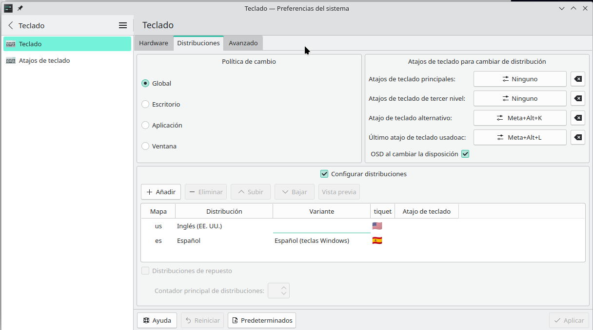
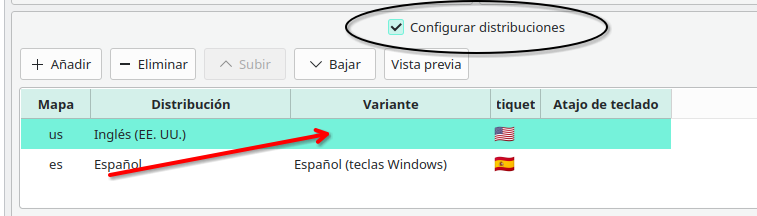

# Linux

## Configuraciones
### Teclado ingles o spanish
Tengo un teclado generico en ingles y al presionar shift+ algun signo como # me lo escribian mal, como si fuera otro teclado. 
Para cambiar eso, se debe ir a configuracion - teclado - distribuciones - configurar distribuciones  y agregar el idioma del teclado y el tipo de teclado.

SI tienen un teclado en ingles generico como el mio. Dejen la variante en (Por omision).

