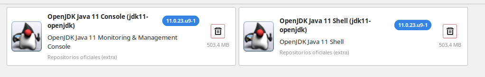
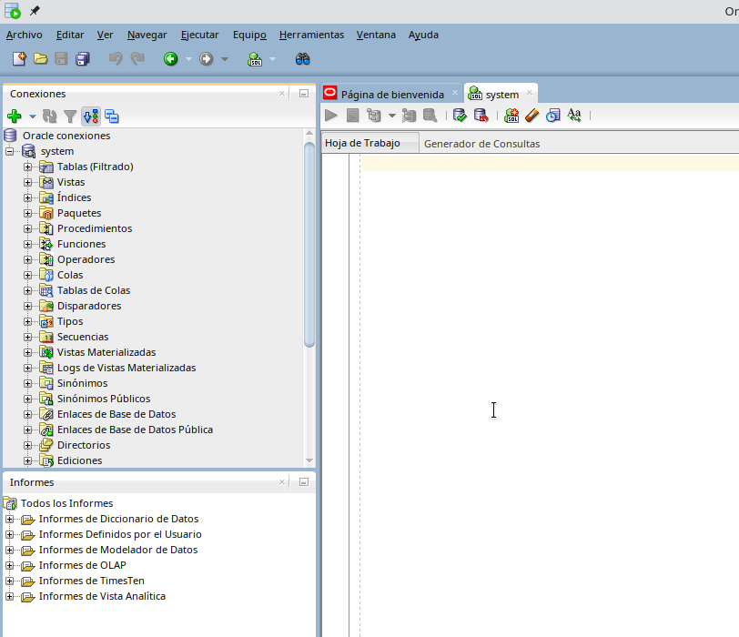
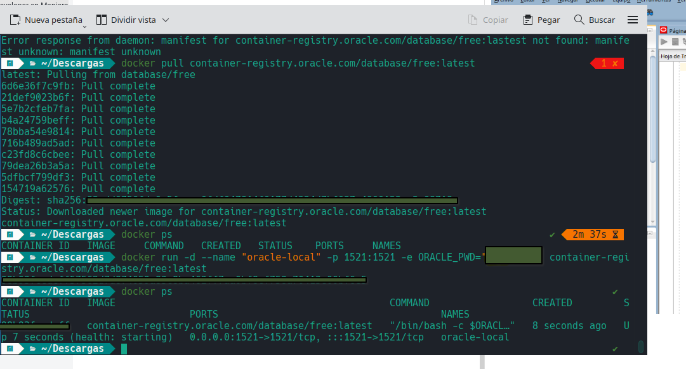

## Oracle SQL developer en Manjaro-Linux

Luego de 3 dias intentando hacer una conexion de sql a la base de datos oracle y casi rendirme con que no se podia usar sqldeveloper en linux, pude hacerlo en con docker.

### PASOS

1.  Instalar sql developer.  
    Para esto, necesitaremos ir a la pagina oficial de oracle  
    https://www.oracle.com/database/sqldeveloper/technologies/download/

- y descargar  
    https://www.oracle.com/webapps/redirect/signon?nexturl=https://download.oracle.com/otn/java/sqldeveloper/sqldeveloper-23.1.1-345.2114.noarch.rpm  
    Solo debes hacer click derecho en lo que dice download en la parte que dice Linux RPM y se te descarga. Se deberia ver asi: sqldeveloper-23.1.1-345.2114.noarch.rpm
    
- Creamos un directorio para contender la extraccion. Y extraemos contenido.
    

```
mkdir sqldeveloper
mv rpmextract.sh sqldeveloper-23.1.1-345.2114.noarch.rpm directorioreciencreado
```

```
sudo pacman -S rpmextract
rpmextract.sh sqldeveloper-23.1.1-345.2114.noarch.rpm
```

2.  Necesitaremos JDK de java. En mi caso habia instalado la version mas actual de java: 22. Pero al iniciar en sql me decia que eran compatible las versiones 17.1 y menores. Intenta descargar la version mas actual y luego si ves que te pide otra version, la desinstalas e instalas la version que te permite usar.

```
sudo pacman -Syu
sudo pacman -S jdk-openjdk
```

Revisas la version con `java -version`

EJecutamos sqldeveloper para saber la version que necesitas. Este se encuentra en la carpeta:  
`opt/sqldeveloper/`  
con nombre **sqldeveloper.sh**. Lo abres y lo ejecutas

**Para cambiar de version:**  
Método Usando SDKMAN (Administrador de versiones de Software Development Kit)

```
curl -s "https://get.sdkman.io" | bash
```

Puede que te pida instalar unzip o zip. Solo instala y vuelve a ejecutar el comando de arriba.

```
sudo pacman -S unzip
sudo pacman -S zip
```

Y seguimos. Instalaremos la version 17.0.1 (Instala la que te pida sql)

```
sudo pacman -S unzip
sdk install java 17.0.1-open
```

Desinstalamos la version mas actual de java

```
sudo pacman -R jdk-openjdk
```

Verifica: `java -version`

Al verifica que tengas eso en el lanzador de aplicaciones:  
  
Si no los tienes. Solo clickea sobre alguno y te enviara para que descargues los paquetes:  
  
Luego clickea en ejecutar java.

Finalmente, te dejara abrir sql developer.  
Si no te deja abrir, enviame un dm a twitter:  
https://x.com/whitebownitro

Si quieres instalar Oracle XE en Manjaro. A dia 26-05-2024 no se puede y si se puede, no tengo idea como hacerlo. Pero al instalar la base de datos de oracle, siempre te estara corriendo en el sistema, quitando memoria.  
Despues de tanto buscar alguna solucion e instalando muchos packetes que crei que servirian. Encontre la solucion en DOCKER con contenedores.  
Hice la conexion de sql a docker  



